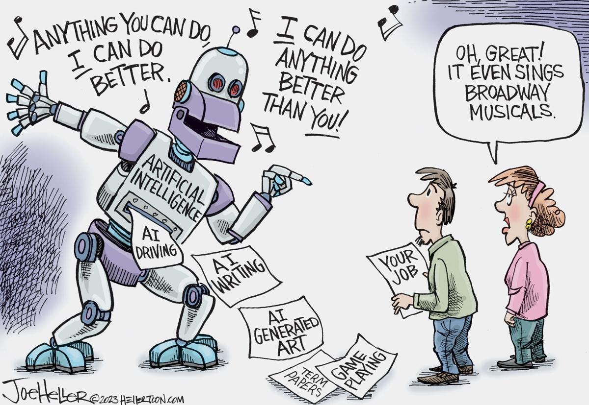

 ---
layout: essay
type: essay
title: "AI: A Honey Trap For Students"
# All dates must be YYYY-MM-DD format!
date: 2024-05-07
published: true
labels:
  - Artificial Intelligence
---

### I. Introduction
Artificial intelligence is something my generation both loves and fears. AI’s defining characteristic is its ability to think and act like humans and mirror our intelligence. Applications such as ChatGPT demonstrate the competence and power that AI provides to its user. The convenience of being able to ask almost any question and get an immediate, concise answer generated back, without having to sift through websites on your own, is the reason why many students use AI for their schoolwork. When I first started college, artificial intelligence and ChatGPT was very new and intimidating to me. I believed using it was cheating and wrong because I never experienced using AI in highschool and felt bitter hearing about how so many students used it to easily complete assignments that I would spend hours of my own time trying to do. It wasn’t until I got to college and had classmates that I respected as hard working, good students that encouraged me and talked about their use of ChatGPT to help do their homework. However, the convenience and ease of using the application is dangerous because the user can fall into the trap of blindly following what it says as truth and fact.

### II. Personal Experience with AI:
I have used AI in class this semester in the following areas:

  1. Experience WODs e.g. E18
     I would sometimes use ChatGPT when completing experience WODs because 
  2. In-class Practice WODs
     
  3. In-class WODs

  4. Essays

  5. Final project

  6. Learning a concept / tutorial

  7. Answering a question in class or in Discord

  8. Asking or answering a smart-question

  9. Coding example e.g. “give an example of using Underscore .pluck”

  10. Explaining code

  11. Writing code

  12. Documenting code

  13. Quality assurance 

  14. Other uses in ICS 314 not listed above

### III. Impact on Learning and Understanding:

### IV. Practical Applications:

### V. Challenges and Opportunities:

### VI. Comparative Analysis:

### VII. Future Considerations:

### VIII. Conclusion:
