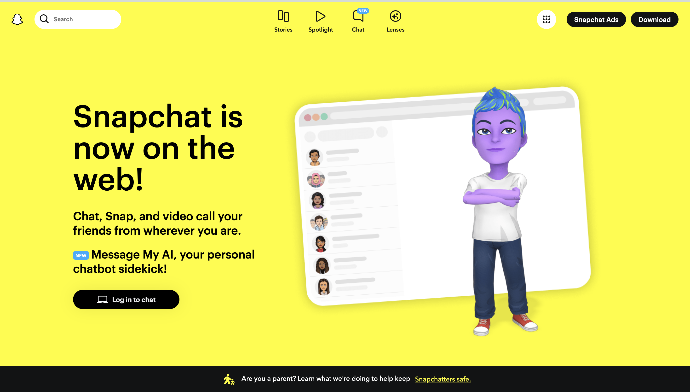
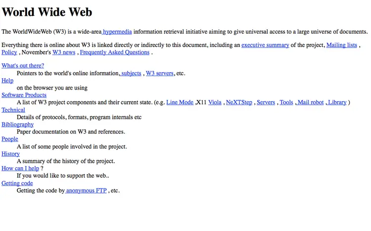

UI Framework is short for User Interface Framework, which is a collection of useful components, libraries, and tools that developers can use to make new user interfaces for websites or applications. They provide sets of code that are aimed at helping people create more consistent and visually appealing UIs without having to code them completely on their own.

## Y UI?
The UI framework we have been using is Bootstrap. Some argue that UI’s are too complicated and frustrating to learn and that it is better to just use raw HTML and CSS. However, as someone who had just learned to code in HTML recently, I have found using UI Frameworks useful. I believe it is easier from my personal experience as a beginner, I would much rather use Bootstrap than code things like drop-down menus and nav bars on my own.

## POV UI
At first glance, a UI page with many lines of different code for various functions might be intimidating because there are so many lines. However, as a beginner, I think that UI Frameworks provide a jumping-off point for the developer. Instead of having to code things from scratch, I can just copy and paste some of the code from the UI Framework’s website and change a few things to make it customized to the website I want to build. In addition, there are other pros UI Frameworks provide. Firstly, it is time efficient you don’t have to think about or build from scratch some aspects, and it is a safe choice because if you use a well-known and widely used program, it was likely tested and debugged many times before it became available for public use.

Many brands that are recognizable use UI Frameworks. For example, Semantic UI was used to build the Snapchat website. It shows that these frameworks are trustworthy because they can create a good, clean aesthetic website for recognizable brands. When websites first came out, they weren’t as aesthetic as the ones we have now because there were no UI Frameworks for novice html users to lean on. Here is a picture of what the first website looked like. There were no graphics or drop-downs because the main focus was its functionality.
     
## TTYL
Others might have a different stance on UI Frameworks. Those with much more experience and knowledge might prefer to code everything from scratch because they are comfortable with html. I can see the appeal of this stance if you have a lot of experience, a very specific vision for what you want your website to look like, and the skills to execute it. In this case, a UI Framework might feel limiting. However, I feel that this is a much rarer case in the wide scope of people who are trying to use languages like html, so I feel that UI Frameworks are still an extremely valid choice for those who want to make an aesthetically pleasing webpage.

