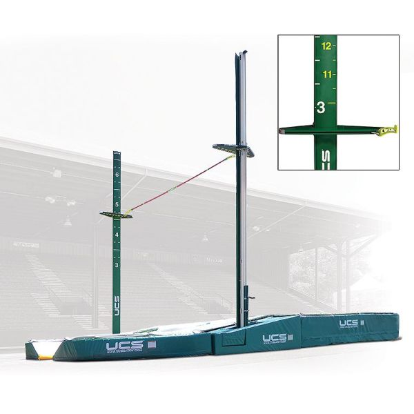

In pole vaulting, we literally raise the standards. The two mechanisms on either side of the vaulting pit are actually called "standards." After clearing each vault, we usually raise them 3 to 6 inches. Every time aiming higher and higher, pushing ourselves to our limits until the standards are raised too high and we eventually fail, falling with the bar off the standards.

