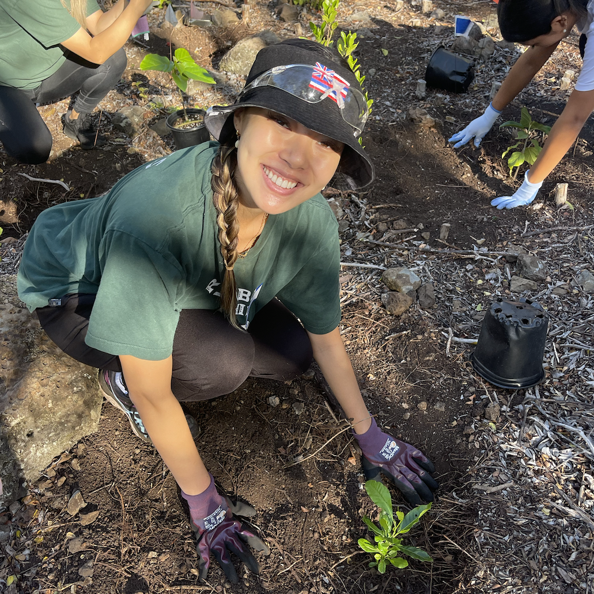

  
  
  

As community service chair, I'm in charge of scheduling at least one community service event a month, but I usually schedule two events per month so everyone can participate in helping our community despite their scheduling differences. In 2023 from the months November to December,
