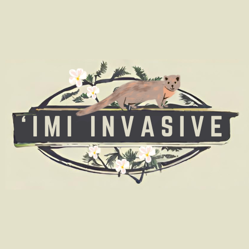

---
layout: project
type: project
image: img/imi-invasive.png
title: "'Imi Invasive"
date: 2024
published: true
labels:
  - Website
  - Meteor
  - React
  - Collaboration
summary: "My team created a web-application using Meteor React to address invasive species management challenges by establishing a community to educate people on invasive species."
---  
# 'Imi means "search" in ʻŌlelo Hawaiʻi

Invasive species pose a significant threat to local ecosystems, causing ecological imbalances or even extinction. However, monitoring and tracking these invasive species across the Hawaiian islands can be a daunting and resource-expensive task, making research difficult to complete.

‘Imi Invasive aims to address invasive species management challenges by establishing a citizen science initiative to bring the community together and educate people on invasive species, raising awareness and empowering the community and professionals to be able to better track the harmful species and care for the ecosystem. It should serve as an educational resource and also a centralized app for people to report and help manage invasive species across the Hawaiian Islands.

To see our entire process, you can visit our [project page]([https://islandinvaders.github.io/]), or check out our group's [Island Invaders organization page]([https://github.com/islandinvaders]), to see the source code and learn more about it. 

## My constributions

    
    
    

      

        One of my main focuses of the website was making it look professional and different from the Meteor React template that we started with. For example, I moved the login to its own component at the top of the page instead of having it in the NavBar. Throughout this project, I edited mostly the style.css file and the landing page. A lot of the effort I put into this project was outside of coding, which I was okay with because I had learned a lot about making functional Meter React web applications during our Experience WODs we did for homework. 
      

      

        I designed an original logo to make us stand out and to help portray our organization. I added a mongoose as our mascot because it is one of the most recognizable invasive species to local people in Hawaii. Through our web application's aesthetics, I wanted to portray the nature-centric theme of our organization.
      

      

        The creation of our logo helped me to come up with a custom color scheme by giving me a base idea for the aesthetic that we could use around the web application to make it look more cohesive. I used these colors to add depth and interaction animations to the page's NavBar links and buttons so that when the user hovered above different words. I added an animated bar above the NavBar to make the website more interactive and used colors to indicate what page you were on depending on what link was active.
      

      

        In addition to making sure that the color scheme was cohesive across the web application, I had to find, compile, and import different fonts to use for different aspects of the pages. For example, the headers and sub-headers had different fonts from the body paragraphs, and many times I would have to make different custom classes in the style.css file to change the font-weight, font-family, padding, margins, and colors. 
      

      

        On the landing page, I had to learn how to create an image carousel using Bootstrap with text overlay and auto-scrolling. I also created a collage of recognizable, common invasive species in Hawaii, and organized the text around it to make it look more aesthetic. I spent a lot of time looking at and studying websites made by other Hawaii local businesses to make our web application more appealing to our target audiences.
      

    

## What I learned
I  learned valuable lessons about collaboration and communication in a group setting. One key aspect was the importance of disclosing and communicating my weaknesses to my team. By being open about my limitations, I found that we could work together more effectively, leveraging each other's strengths to overcome challenges. Before, I would prefer to work alone because I know that my process can be scattered at times, and difficult for others to understand, but now I see the benefits of working in a group of individuals that support each other. Additionally, I learned the value of asking for help when I was stuck. Rather than struggling in silence, reaching out to my team for assistance not only helped me solve problems faster but also fostered a sense of camaraderie and teamwork. These experiences taught me that vulnerability and communication are essential for successful collaboration.
