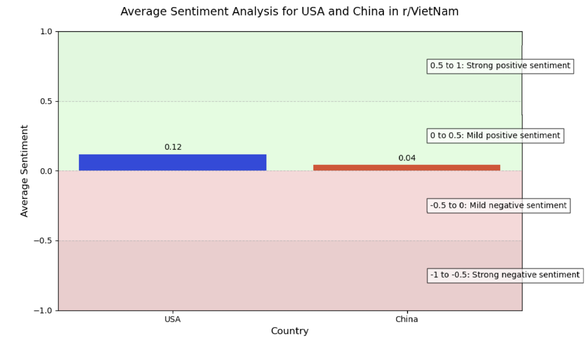

I mentor the summer cohorts for HII's internship program. Every year, we break the large cohort into smaller groups and task them with a capstone project based on the skills and knowledge they gained throughout the program. The small group that I was particularly in charge of mentoring did their capstone project on examining how China's international information campaign affects US relations in the Indo-Pacific country of Vietnam.

To aid my group, I developed a Reddit scraper using a Python Reddit API Wrapper (PRAW) to collect posts and comments from the r/Vietnam subreddit containing mentions of China and the US. Using this data, I was able to conduct a sentiment analysis using TextBlob and generate sentiment scores to evaluate Vietnam's public opinion of the US and China. I then used these sentiment scores and Matplotlib to create a bar graph to visualize my results more clearly.

ipynb file available upon request!
