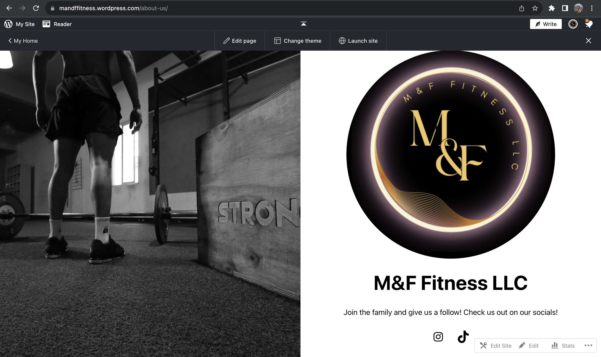
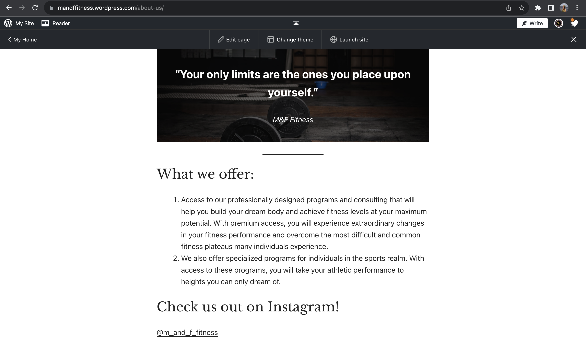

     
I was recruited by a start-up run by local boys who attend UH Manoa. Their goals were to create a company where they could provide workout plans, and personal training to those who wanted to get fit but didn't know where to start. I was reached out to because they heard that I'm a computer science major and they didn't know where to start with building a website. I offered my help and it turned out to be a great learning experience.

I had periodic meetings with them to set goals and expectations for that time. My duties as the website development intern were to develop and maintain the company website by implementing design changes and updates. I had to collaborate with the executive and marketing teams to create appealing and user-friendly web pages aligned with the company.

This expanded my collaborative and communication skills. I had to make sure my time management was in shape so I could appropriately schedule meetings during my free time while also being a full-time student. I needed to understand the vision of the marketing teams such as what they wanted their values to be and what they wanted their brand to look like so I could implement them in the website. This all contributed to my growth as a team member and developer.

### Disclaimer
The website is no longer available, but I have included some screenshots of what some pages looked like after I completed it. If you're interested in knowing more, I can get you in contact with the team that I worked with upon request.
